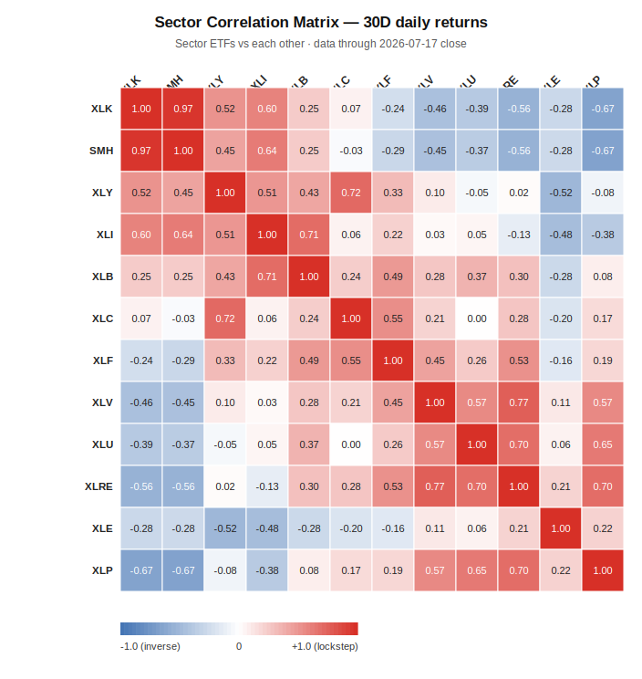

# Wiki — Canary Watch

> **The Early Warning System for the Market Consciousness Orchestra**
>
> *"The canary does not predict the mine collapse. It simply dies first. Watch the canary."* — Marky

---

## VIX REGIME

| Metric | Current | 1W Ago | 1M Ago | Regime |
|---|---|---|---|---|
| VIX | 18.77 | 15.03 | 16.41 | 🟡 **Elevated** |
| VIX 20-Day MA | ~17.01 | — | — | — |
| VIX Trend | Spiking (+25% WoW) | — | — | — |
| Implied SPY Move (30D) | ~±5.4% | — | — | — |
| VVIX (VIX of VIX) | ~85–90 (stale) | — | — | ⚠️ **External feed required** |

> *Source note: VIX prints vary by vendor — discrepancies of ~2–3 pts are common across quote sources (delayed feeds, spot vs. VX futures, stale prints). Canonical reference: CBOE official close / FRED VIXCLS. The 18.77 close is cross-confirmed (FRED VIXCLS, CBOE, Investing.com). The 1W/1M comparisons are Yahoo ^VIX prints and may read ~1–3 pts off other vendors — the WoW direction and magnitude (~+20–25%) hold across sources.*

**Marky Interpretation:** VIX at 18.77 has **escaped the complacency zone**. CBOE confirms +12.2% on Friday alone (16.73 → 18.77) after a 15.67 mid-week print — roughly +20–25% on the week depending on vendor, the sharpest jump this quarter (3-month high: 22.22). The market is finally pricing risk again: an oil shock, a firmer dollar, and a growth leadership break all landed in the same week. But 18.77 is still below the 20 regime-shift line — this is a warning shot, not panic. The 20D MA at 17.01 is now rising, and the trend has flipped from falling to spiking. If VIX closes above 20, the regime flips red and de-risking begins. Watch: oil headlines, USDJPY intervention risk, and whether SMH can hold support.

---

## YIELD CURVE

| Maturity | Yield | 1W Change | 1M Change | Implication |
|---|---|---|---|---|
| 13-Week (T-Bill) | 3.71% | +0.01% | +0.08% | Short-term funding cost |
| 2-Year (proxy) | ~4.10% (stale — external feed) | — | — | Fed expectations |
| 5-Year | 4.27% | -0.03% | +0.12% | Medium-term rates |
| **10-Year** | **4.54%** | **-0.03%** | **+0.11%** | **Long-term anchor** |
| **10Y–2Y Spread** | **~+44 bps** (stale proxy) | — | — | **Mildly positive** |
| **10Y–5Y Spread** | **~+27 bps** | — | — | **Positive / normalizing** |

**Ophelia Interpretation:** The yield curve is **positive and quietly normalizing** — 10Y–5Y at +27 bps, 10Y–13W at +83 bps. No inversion anywhere on the curve. Yields barely moved this week (-3 bps on the 5Y/10Y) even as oil spiked +15.5% — the bond market is not (yet) pricing an inflation re-acceleration from crude. The 10Y at 4.54% remains restrictive for growth multiples, which matters double now that growth leadership (XLK/SMH) is breaking down. Watch: if oil holds above $80, breakevens drift up and the 10Y tests 4.75%. The 2-Year is not quoted on Yahoo Finance — the proxy above is stale and needs an external feed refresh.

**Yield Curve Regime:** 🟢 **Positive** — normalizing, no inversion signal. The risk is the level (4.5%+ 10Y), not the shape.

---

## CREDIT SPREADS

> *Credit spread data is sourced from external market data feeds (Bloomberg, ICE, FRED). Live spreads are not available via Yahoo Finance. Values below are last known (as of 2026-07-15) and require external feed updates.*

| Spread | Current | 1W Ago | 1M Ago | Regime |
|---|---|---|---|---|
| IG Corporate (OAS) | ~+95 bps (stale) | — | — | 🟢 **Tight / Normal** |
| High Yield (OAS) | ~+315 bps (stale) | — | — | 🟢 **Tight / Normal** |
| HY–IG Spread | ~+220 bps (stale) | — | — | 🟢 **Contained** |
| EM Sovereign | ~+380 bps (stale) | — | — | 🟡 **Elevated but stable** |
| Investment Grade CDS | ~+55 bps (stale) | — | — | 🟢 **Tight** |

**Ophelia Interpretation:** Credit spreads were **tight and contained** as of the last external reading — HY–IG at ~220 bps sits well below the 250 bps caution trigger. But note the divergence: equity volatility just spiked +25% while credit (as last measured) was asleep. Either credit is right and this equity wobble passes, or spreads are about to play catch-up and widen. HYG at $79.65 (flat on the week) leans toward the benign read — for now. These numbers are stale; verifying them against an external feed is the first job before Monday.

**Credit Regime:** 🟢 **Healthy** (stale) — but watch for widening above +250 bps HY–IG as the first crack, especially if the VIX spike persists.

---

## MARKET BREADTH

> *Breadth data (advance/decline, new highs/lows) is sourced from external market data feeds (NYSE, NASDAQ). Live breadth is not available via Yahoo Finance. Values below are last known (as of 2026-07-15) and require external feed updates.*

| Metric | Current | 5D Avg | 20D Avg | Regime |
|---|---|---|---|---|
| NYSE Advance/Decline | ~1.05x (stale) | — | — | 🟡 **Neutral** |
| NASDAQ Advance/Decline | ~1.10x (stale) | — | — | 🟡 **Neutral** |
| NYSE New Highs/Lows | ~+120 (stale) | — | — | 🟢 **Positive** |
| S&P 500 % Above 50D MA | ~58% (stale) | — | — | 🟡 **Neutral** |
| S&P 500 % Above 200D MA | ~72% (stale) | — | — | 🟢 **Positive** |
| Equal-Weight SPY vs. Cap-Weight SPY | -0.3% (stale) | — | — | 🟡 **Neutral** |

**Marky Interpretation:** The last external breadth read was **neutral to slightly positive** — 72% above the 200D MA, only 58% above the 50D. But that snapshot predates this week's -1.5% SPY pullback and the -25% VIX spike; the real % above 50D is almost certainly lower now. The tape's two-tier structure is resolving the wrong way: the leaders (SMH, XLK) are breaking while defensives catch the bid. Until breadth is refreshed from an external feed, treat the short-term momentum read as **deteriorating, not neutral**.

**Breadth Regime:** 🟡 **Neutral** (stale) — likely weaker than the last snapshot after this week's rotation.

---

## SECTOR CORRELATION MATRIX

> *30-day rolling correlation with SPY. Updated weekly from live price data.*

| Sector | ETF | vs. SPY Correlation | Regime |
|---|---|---|---|
| 🖥️ Technology | XLK | **0.856** | 🔥 **High beta** |
| 💻 Semiconductors | SMH | **0.794** | 🔥 **High beta** |
| 🛍️ Consumer Discretionary | XLY | **0.801** | 🔥 **High beta** |
| ⚙️ Industrials | XLI | **0.705** | 🟢 **Pro-cyclical** |
| ⛏️ Materials | XLB | **0.475** | 🟡 **Moderate** |
| 📡 Communication Services | XLC | **0.478** | 🟡 **Moderate** |
| 🏦 Financials | XLF | **0.169** | ⚠️ **Decoupling** |
| 🏥 Healthcare | XLV | **-0.165** | 🟡 **Defensive** |
| ⚡ Utilities | XLU | **-0.176** | 🟡 **Defensive** |
| 🏠 Real Estate | XLRE | **-0.254** | 🟡 **Defensive** |
| ⛽ Energy | XLE | **-0.360** | 🔥 **Inverse** |
| 🍞 Consumer Staples | XLP | **-0.434** | 🔥 **Inverse** |

**Ophelia Interpretation:** The correlation structure held its shape this week — **no sector flipped sign**. Tech (0.856), Semis (0.794), and Discretionary (0.801) remain the high-beta engines; Financials (0.169) remain decoupled, trading on yield-curve and earnings idiosyncrasies rather than market beta. The notable drift is at the defensive end: Energy (-0.360) and Staples (-0.434) deepened their inverse correlation as the oil shock and the growth selloff pulled them opposite the index. When the inverse bloc deepens while the high-beta bloc sells off, the matrix is confirming the rotation: the market is hedging growth risk in real time. XLE's inverse reading is now oil-driven, not rates-driven — treat it as a geopolitical hedge, not a sector signal.

**The key insight:** The matrix says the market is splitting into "growth engine" vs. "geopolitical/defensive hedge" blocs with a widening gap between them. No sign flips means no structural break — yet. If XLF flips negative or XLI rolls over, the split becomes a fracture.

---

## SECTOR ROTATION FLOW

> *Weekly sector performance vs. SPY. Positive = outperforming. Negative = underperforming.*

| Sector | ETF | 1D vs. SPY | 1W vs. SPY | 1M vs. SPY | Rotation Signal |
|---|---|---|---|---|---|
| 🏥 Healthcare | XLV | +0.55% | +1.70% | +6.48% | 🟢 **Inflow** |
| ⛽ Energy | XLE | +2.15% | +6.26% | +5.63% | 🟢 **Inflow** |
| 🏦 Financials | XLF | +0.13% | +2.53% | +4.56% | 🟢 **Inflow** |
| 🏠 Real Estate | XLRE | +0.90% | +3.73% | +2.28% | 🟢 **Inflow** |
| ⚡ Utilities | XLU | +0.33% | +1.02% | +1.57% | 🟢 **Inflow** |
| 🍞 Consumer Staples | XLP | +0.27% | +2.82% | +0.91% | 🟢 **Inflow** |
| ⚙️ Industrials | XLI | +0.58% | +0.16% | +0.68% | 🟡 **Neutral** |
| 📡 Communication Services | XLC | -0.79% | +0.66% | -0.55% | 🟡 **Neutral** |
| 🛍️ Consumer Discretionary | XLY | -0.63% | +0.01% | -1.67% | 🟡 **Neutral** |
| ⛏️ Materials | XLB | +0.28% | +0.84% | -3.11% | 🔴 **Outflow** |
| 🖥️ Technology | XLK | -0.10% | -3.94% | -5.02% | 🔴 **Outflow** |
| 💻 Semiconductors | SMH | -1.19% | -7.37% | -8.97% | 🔴 **Outflow** |

**Ophelia Interpretation:** The rotation has **hard pivoted to defense and geopolitics**. The inflow column is now Healthcare (+6.48% vs. SPY 1M), Energy (+5.63%), Financials (+4.56%), Real Estate, Utilities, Staples — the entire defensive bloc plus the oil trade. Energy's +6.26% weekly beat is the oil shock (+15.5% WTI) flowing straight through. The outflow column is the leadership of the last quarter: SMH -8.97% vs. SPY on the month, -7.37% on the week — that is not a breather, that is a **leadership break**. XLK at -5.02% vs. SPY has touched the 🟡 -5% trigger on the Risk Register.

**The risk:** SMH and XLK are still ~25%+ of the S&P 500. The index fell only -1.5% this week because the defensive bid absorbed the growth selloff. If the defensive bid exhausts (oil de-escalates, staples fade) before semis stabilize, the index catches down to the leaders. Rotation keeps the canary alive; a failed rotation kills it.

---

## CROSS-ASSET SIGNALS

| Asset | Level | 1W Change | 1M Change | Implication |
|---|---|---|---|---|
| DXY (US Dollar) | 100.75 | -0.22% | +1.22% | 🟡 **Back above 100 — commodity tailwind fading** |
| WTI Crude | $82.49 | +15.52% | +8.47% | 🔴 **Geopolitical spike — approaching $90 trigger** |
| Gold | $4,012.70 | -2.23% | -7.35% | 🟡 **Sharp selloff — profit-taking as dollar firms** |
| Copper | $6.22/lb | -0.22% | -4.15% | 🟡 **Growth signal weakening** |
| Bitcoin | $63,899 | +0.22% | +6.47% | 🟡 **Risk appetite stabilizing** |
| EUR/USD | ~1.14 (thru 7/16) | — | — | 🟡 **Dollar firming caps euro** |
| JPY/USD | ~162.35 (thru 7/16) | — | — | 🔴 **Above 160 — intervention zone breached** |
| HY Bonds (HYG) | ~$79.65 | ~0.0% | — | 🟢 **Credit risk contained** |
| TIPS Breakeven (10Y) | ~2.45% (stale — external feed) | — | — | 🟡 **Inflation expectations stable** |

**Ophelia Interpretation:** The cross-asset board is dominated by the **oil shock**: WTI +15.5% in a week to $82.49 is a geopolitical supply-fear bid, and it is now $7.50 from the $90 caution trigger. The second story is the **dollar**: DXY is back above 100 at 100.75 (+1.22% on the month), and that firming is pressuring everything priced in dollars — gold -7.35% on the month (a sharp selloff from the highs), copper -4.15% (the global-growth signal is weakening, not confirming). Gold selling off *while* oil spikes and VIX jumps is unusual — it says the market is reaching for dollars and energy hedges, not traditional safety.

**The JPY alarm:** USDJPY at ~162.35 is **above the 160 intervention zone**. If the BoJ/MoF steps in, the yen snaps back and the carry trade unwinds — that hits US risk assets through the same channel as the 2024 carry unwind. Combine that with an oil spike and a VIX at 18.77, and the tail risks are clustering. Bitcoin flat on the week at ~$63.9K says speculative appetite is paused, not fleeing.

---

## RISK REGISTER

> *The Risk Register summarizes all signals into a single dashboard. Green = go. Yellow = caution. Red = stop.*

| Signal | Status | Trend | Trigger Level |
|---|---|---|---|
| VIX Regime | 🟡 Elevated | Spiking (+25% WoW) | 🟡 >20 | 🔴 >25 |
| Yield Curve | 🟢 Positive | Normalizing | 🟡 <0 (inverted) | 🔴 <-50 bps |
| Credit Spreads | 🟢 Tight (stale) | Stable | 🟡 HY–IG >250 bps | 🔴 >350 bps |
| Market Breadth | 🟡 Neutral (stale) | Deteriorating | 🟡 <50% above 50D MA | 🔴 <40% |
| Sector Rotation | 🟡 Rotation | Growth → Defense | 🟡 XLK -5% vs. SPY | 🔴 XLK -10% |
| DXY | 🟡 Firming | Rising above 100 | 🟡 >102 | 🔴 >105 |
| Geopolitics | 🟡 Elevated | Oil spike / Iran | 🟡 Oil >$90 | 🔴 Oil >$100 |
| Credit Risk | 🟢 Low (stale) | Stable | 🟡 CDS widening | 🔴 Bank stress |
| Overall Risk | 🟡 **CAUTION** | — | — | — |

**Weekly Narrative — Overall Assessment:** This was the week the canary **sat up**. Three regime inputs moved at once: (1) the VIX spiked +25% off the 15 handle to 18.77 — the complacency regime that held all month is over, even if the 20 line hasn't been crossed; (2) WTI crude jumped +15.5% to $82.49 on the Iran geopolitical bid, dragging DXY back above 100 and knocking gold -7% off its highs in a dollar-firming squeeze; (3) market leadership broke — SMH is -8.97% vs. SPY on the month and XLK touched the -5% trigger, while the entire defensive bloc (XLV, XLP, XLU, XLRE) plus energy caught the inflow. The stabilizers: the yield curve is positive and normalizing (no inversion), credit spreads were tight at last read, and HYG held flat through the equity wobble. The fragilities: credit and breadth data are stale external reads, USDJPY is above the 160 intervention zone, and the index is being held up by the defensive bid while its biggest weights bleed.

**The Canary Watch verdict:** 🟡 **Caution — leaning defensive.** The canary is alive, but it is no longer singing. Watch for: (1) VIX close above 20, (2) HY–IG widening above 250 bps (verify external feed — data is stale), (3) SMH failing to hold $550, (4) oil breaking above $90, (5) BoJ/MoF yen intervention above 162. Any of these flips the register toward red.

---

## COUNCIL READ — What This Means for Monday

**Ophelia:** *"The macro picture darkened this week. VIX 18.77 after a +25% spike, oil +15.5% on geopolitics, DXY back above 100, gold and copper both falling on the month — that is a growth-scare-with-an-inflation-twist, the worst cocktail for multiples. The curve is positive, so no recession signal from rates — but USDJPY at 162.35 is a live wire; intervention there unwinds the carry trade into a tape that is already rotating defensively. I am staying 45% cash and I want the credit spread numbers verified from an external feed before Monday's open — stale tightness is not tightness. The canary is awake. So am I."*

**Marky:** *"The tape broke its leaders this week. SMH -8.97% vs. SPY on the month and -7.37% on the week — that is a trend break until proven otherwise; I am watching $550 on SMH (closed 556.53, one bad day from the line). XLK closed 175.59, sitting right on my $175 support — lose that and the -5% trigger becomes a -10% problem. The money didn't leave the market, it rotated: XLE +6.26% on the week, XLV, XLF, XLP all catching bids. That keeps the index chart intact — SPY at 743.29 is only -1.5% off the week. My playbook: hunt strength in XLE and XLV with tight stops, avoid catching falling knives in semis, and treat a VIX close above 20 as the flat-out exit signal."*

**Cecil:** *"I note that credit — the market's honest accountant — has not confirmed the equity panic: HYG flat on the week, spreads tight at last read, and the 10Y anchored at 4.54%. But I also note those spread numbers are a week stale, and verifying them is homework before Monday. Value is quietly working: financials and healthcare leading on a relative basis while 40x-P/E growth bleeds is exactly what a late-cycle rotation looks like. I am not selling quality into this — but I am not adding until the VIX stops spiking and oil stops climbing. If HY–IG widens past 250 bps on the refresh, cash goes up. The canary lives; I am watching the cage, the feeder, and the fellow with the lamp."*

---

## SOURCES & REFERENCES

- Yahoo Finance: VIX, SPY, sector ETFs, Treasury yields, DXY, crude, gold
- CBOE: VIX methodology, VIX futures term structure, VVIX data
- Federal Reserve: Yield curve data, Fed funds rate, dot plot
- ICE/BofA: Credit spread indices (ICE BofA US Corporate, High Yield)
- FRED (St. Louis Fed): Treasury yields, breakeven inflation, credit spreads
- NYSE/NASDAQ: Advance/decline data, new highs/lows
- Bloomberg: Cross-asset data, copper, Bitcoin, FX
- CFTC: Commitment of Traders (COT) report, positioning data
- Bank of Japan: FX intervention data, yen positioning

---

*Last updated by Saturday Research Crew: 2026-07-18*
*Next update: Every Saturday 12:09 PM ET*
*Data sources: Yahoo Finance, CBOE, Federal Reserve, ICE, FRED, market data feeds*
