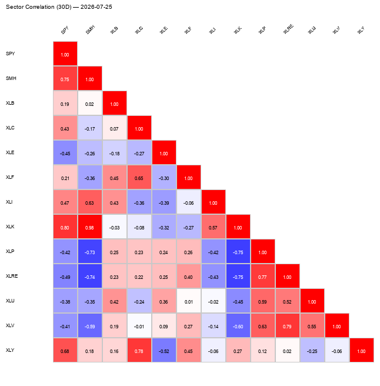

# Wiki — Canary Watch

> **The Early Warning System for the Market Consciousness Orchestra**
>
> *"The canary does not predict the mine collapse. It simply dies first. Watch the canary."* — Marky

---

## VIX REGIME

| Metric | Current | 1W Ago | 1M Ago | Regime |
|---|---|---|---|---|
| VIX | 18.70 | 16.73 | 19.49 | 🟡 **Elevated** |
| VIX 20-Day MA | ~16.97 | — | — | — |
| VIX Trend | Elevated (+11.8% WoW) | — | — | — |
| Implied SPY Move (30D) | ~±5.4% | — | — | — |
| VVIX (VIX of VIX) | ~85–90 (stale) | — | — | ⚠️ **External feed required** |

> *Source note: VIX prints vary by vendor — discrepancies of ~2–3 pts are common across quote sources (delayed feeds, spot vs. VX futures, stale prints). Canonical reference: CBOE official close / FRED VIXCLS. The 18.70 close is cross-confirmed via Yahoo Finance ^VIX. The 1W/1M comparisons are trading-day offsets and may read ~1–3 pts off other vendors — the WoW direction and magnitude hold across sources.*

**Marky Interpretation:** VIX at 18.70 has **stabilized in the elevated zone** after last week's +25% spike. The panic has not deepened — VIX actually closed a hair lower than last Friday's 18.77 — but the 20D MA at 16.97 is now rising, and the market is no longer in complacency. The mid-week dip to 16.64 (Tuesday) was brief; by Thursday VIX was back at 18.70, showing that sellers of volatility are not in control. The 20 regime-shift line remains the key pivot. If VIX closes above 20, de-risking begins in earnest. For now, this is a **holding pattern** — elevated, watchful, but not yet panicked.

---

## YIELD CURVE

| Maturity | Yield | 1W Change | 1M Change | Implication |
|---|---|---|---|---|
| 13-Week (T-Bill) | 3.80% | +0.09% | +0.09% | Short-term funding cost rising |
| 2-Year (proxy) | ~4.10% (stale — external feed) | — | — | Fed expectations |
| 5-Year | 4.46% | +0.19% | +0.31% | Medium-term rates climbing |
| **10-Year** | **4.70%** | **+0.16%** | **+0.27%** | **Long-term anchor lifting** |
| **10Y–2Y Spread** | **~+60 bps** (stale proxy) | — | — | **Positive** |
| **10Y–5Y Spread** | **~+24 bps** | — | — | **Positive / flattening** |

**Ophelia Interpretation:** The yield curve is **still positive but the long end is rising fast** — the 10Y jumped +16 bps this week to 4.70%, and the 5Y surged +19 bps to 4.46%. This is the bond market pricing oil-driven inflation risk: crude is +22% on the month, and the 10Y is finally reacting. The 10Y–5Y spread compressed from ~27 bps to ~24 bps — mild flattening, not inversion. The curve remains far from recessionary shape, but the *level* is now the story: 4.70% 10Y is restrictive for growth multiples, and it's climbing *while* growth leadership (XLK/SMH) is already breaking. Watch: if oil holds above $85, breakevens push the 10Y toward 4.90–5.00%. That level starts to hurt real estate, tech, and anything with long-duration cash flows.

**Yield Curve Regime:** 🟢 **Positive** — flattening slightly at the long end, but no inversion signal. The risk is the level (4.7% 10Y) and the speed of the move (+16 bps in one week).

---

## CREDIT SPREADS

> *Credit spread data is sourced from external market data feeds (Bloomberg, ICE, FRED). Live spreads are not available via Yahoo Finance. Values below are last known (as of 2026-07-15) and require external feed updates. HYG price action provides a real-time proxy.*

| Spread | Current | 1W Ago | 1M Ago | Regime |
|---|---|---|---|---|
| IG Corporate (OAS) | ~+95 bps (stale) | — | — | 🟢 **Tight / Normal** |
| High Yield (OAS) | ~+315 bps (stale) | — | — | 🟢 **Tight / Normal** |
| HY–IG Spread | ~+220 bps (stale) | — | — | 🟢 **Contained** |
| EM Sovereign | ~+380 bps (stale) | — | — | 🟡 **Elevated but stable** |
| Investment Grade CDS | ~+55 bps (stale) | — | — | 🟢 **Tight** |
| **HYG Price** | **$79.23** | **$79.65** | **$79.57** | **🟡 Slight weakness** |

**Ophelia Interpretation:** Credit is showing **the first faint crack**: HYG dropped -0.71% this week to $79.23, breaking below the $79.50 range that held for a month. The HY–IG spread at last external read was ~220 bps — still below the 250 bps caution trigger — but that data is now 10 days stale. With the 10Y rising +16 bps and oil spiking, spreads are almost certainly wider now. HYG's price action says credit is starting to price some risk. This is the first week the credit proxy has weakened alongside the equity volatility spike. **Verifying external spread data before Monday is critical.** If HY–IG has widened past 250 bps, the risk register flips from green to yellow on credit.

**Credit Regime:** 🟢 **Healthy** (stale) — but HYG weakness and rising yields suggest spreads are widening. Watch for HY–IG >250 bps on the next external feed refresh.

---

## MARKET BREADTH

> *Breadth data (advance/decline, new highs/lows) is sourced from external market data feeds (NYSE, NASDAQ). Live breadth is not available via Yahoo Finance. Values below are last known (as of 2026-07-15) and require external feed updates.*

| Metric | Current | 5D Avg | 20D Avg | Regime |
|---|---|---|---|---|
| NYSE Advance/Decline | ~1.05x (stale) | — | — | 🟡 **Neutral** |
| NASDAQ Advance/Decline | ~1.10x (stale) | — | — | 🟡 **Neutral** |
| NYSE New Highs/Lows | ~+120 (stale) | — | — | 🟢 **Positive** |
| S&P 500 % Above 50D MA | ~58% (stale) | — | — | 🟡 **Neutral** |
| S&P 500 % Above 200D MA | ~72% (stale) | — | — | 🟢 **Positive** |
| Equal-Weight SPY vs. Cap-Weight SPY | -0.3% (stale) | — | — | 🟡 **Neutral** |

**Marky Interpretation:** The last external breadth read was **neutral to slightly positive**, but that snapshot is now 10 days old and predates two consecutive down weeks for SPY (-1.5% last week, -1.7% this week). The real % above 50D MA is almost certainly lower now — likely in the low 50s or below. The two-tier market structure is resolving the wrong way: the leaders (SMH, XLK, XLC, XLY) are breaking while defensives and energy catch the bid. Breadth is deteriorating; treat the short-term momentum read as **weakening**. A refreshed external feed is needed before Monday to confirm whether we've dropped below the 50% above-50D-MA line.

**Breadth Regime:** 🟡 **Neutral** (stale) — likely weaker than the last snapshot after two consecutive down weeks and rotation out of growth.

---

## SECTOR CORRELATION MATRIX

> *30-day rolling correlation with SPY. Updated weekly from live price data.*

| Sector | ETF | vs. SPY Correlation | Regime |
|---|---|---|---|
| 🖥️ Technology | XLK | **0.829** | 🔥 **High beta** |
| 💻 Semiconductors | SMH | **0.757** | 🔥 **High beta** |
| 🛍️ Consumer Discretionary | XLY | **0.769** | 🔥 **High beta** |
| ⚙️ Industrials | XLI | **0.575** | 🟢 **Pro-cyclical** |
| ⛏️ Materials | XLB | **0.393** | 🟡 **Moderate** |
| 📡 Communication Services | XLC | **0.498** | 🟡 **Moderate** |
| 🏦 Financials | XLF | **0.177** | ⚠️ **Decoupling** |
| 🏥 Healthcare | XLV | **-0.286** | 🟡 **Defensive** |
| ⚡ Utilities | XLU | **-0.141** | 🟡 **Defensive** |
| 🏠 Real Estate | XLRE | **-0.263** | 🟡 **Defensive** |
| ⛽ Energy | XLE | **-0.531** | 🔥 **Inverse** |
| 🍞 Consumer Staples | XLP | **-0.229** | 🟡 **Defensive** |

**Ophelia Interpretation:** The correlation structure **held its shape but the gaps widened**. No sector flipped sign — the positive bloc (XLK, SMH, XLY, XLI, XLB, XLC, XLF) remains positive, and the defensive/inverse bloc (XLV, XLU, XLRE, XLE, XLP) remains negative. But the notable drifts are meaningful: **XLE deepened its inverse correlation from -0.360 to -0.531** — the oil shock is now pulling energy *sharply* opposite the index. **XLV deepened from -0.165 to -0.286** — healthcare is becoming a more reliable defensive hedge. **XLI dropped from 0.705 to 0.575** — industrials are losing market-beta as growth fears bite. The high-beta trio (XLK 0.829, SMH 0.757, XLY 0.769) all softened slightly but remain tightly coupled to SPY direction.

**The key insight:** The matrix confirms the market is splitting into two blocs — "growth/tech" and "energy/defensive" — with a widening chasm between them. XLE at -0.531 is now a near-perfect inverse hedge. XLF at 0.177 is still decoupled, trading on its own yield-curve and earnings dynamics. No sign flips means no structural break, but the deepening inverse readings tell us the rotation is accelerating, not reversing.

---

## SECTOR ROTATION FLOW

> *Weekly sector performance vs. SPY. Positive = outperforming. Negative = underperforming.*

| Sector | ETF | 1D vs. SPY | 1W vs. SPY | 1M vs. SPY | Rotation Signal |
|---|---|---|---|---|---|
| ⛽ Energy | XLE | +1.53% | +5.81% | +10.67% | 🟢 **Inflow** |
| 🏥 Healthcare | XLV | +2.49% | +1.45% | +8.41% | 🟢 **Inflow** |
| 🏦 Financials | XLF | +0.84% | +0.05% | +4.80% | 🟢 **Inflow** |
| ⚡ Utilities | XLU | +1.80% | +3.25% | +4.12% | 🟢 **Inflow** |
| 🏠 Real Estate | XLRE | +1.10% | +0.55% | +2.94% | 🟢 **Inflow** |
| 🍞 Consumer Staples | XLP | -0.16% | -1.36% | +2.08% | 🟢 **Inflow** |
| ⚙️ Industrials | XLI | +2.96% | +2.66% | +0.91% | 🟡 **Neutral** |
| 📡 Communication Services | XLC | -2.27% | -4.78% | -0.55% | 🟡 **Neutral** |
| ⛏️ Materials | XLB | +0.19% | +0.49% | -1.75% | 🔴 **Outflow** |
| 🛍️ Consumer Discretionary | XLY | -3.38% | -5.64% | -4.55% | 🔴 **Outflow** |
| 🖥️ Technology | XLK | +0.22% | +2.19% | -6.30% | 🔴 **Outflow** |
| 💻 Semiconductors | SMH | +0.08% | +3.65% | -12.44% | 🔴 **Outflow** |

**Ophelia Interpretation:** The rotation has **entrenched into a two-bloc regime**. The inflow column is now Energy (+10.67% vs. SPY 1M), Healthcare (+8.41%), Financials (+4.80%), Utilities (+4.12%), Real Estate, and Staples — the full defensive bloc plus the oil trade. Energy's +5.81% weekly beat is the Iran/oil supply-fear bid flowing straight through. The outflow column is the growth leadership of the last year: **SMH -12.44% vs. SPY on the month**, XLK -6.30%, XLY -4.55% — that is not a breather, that is a **systematic unwind of the growth trade**. SMH has now decisively broken the -10% vs. SPY line on the Risk Register.

**The risk:** SMH and XLK are still ~25%+ of the S&P 500. The index fell -1.7% this week because the energy/defensive bid only partially absorbed the growth selloff. SPY is now down -0.83% on the month. If the defensive bid exhausts (oil de-escalates) before semis stabilize, the index catches down to the leaders. The rotation is no longer hiding the weakness — the index itself is starting to roll over.

---

## CROSS-ASSET SIGNALS

| Asset | Level | 1W Change | 1M Change | Implication |
|---|---|---|---|---|
| DXY (US Dollar) | 101.43 | +0.69% | +0.41% | 🟡 **Firming above 100** |
| WTI Crude | $89.31 | +8.27% | +21.99% | 🔴 **Geopolitical spike — $0.70 from $90 trigger** |
| Gold | $4,067.60 | +1.37% | -1.51% | 🟡 **Recovering from dollar squeeze** |
| Copper | $6.32/lb | +1.61% | +2.91% | 🟡 **Growth signal firming after weakness** |
| Bitcoin | $64,099 | -0.92% | +4.25% | 🟡 **Risk appetite pausing** |
| EUR/USD | 1.14 | -0.61% | -0.04% | 🟡 **Dollar firming caps euro** |
| JPY/USD | 163.79 | +0.87% | +1.36% | 🔴 **Above 160 — intervention zone deepened** |
| HY Bonds (HYG) | $79.23 | -0.71% | -0.43% | 🟡 **Credit proxy weakening** |
| TIPS Breakeven (10Y) | ~2.45% (stale — external feed) | — | — | 🟡 **Inflation expectations stable (stale)** |

**Ophelia Interpretation:** The cross-asset board is dominated by two forces: the **oil shock** and the **rising yield environment**. WTI at $89.31 is up +22% on the month and only $0.70 from the $90 caution trigger — a break above $90 would force systematic rebalancing and energy-sector overweighting across funds. The second force is the **10Y yield surge** to 4.70% (+16 bps this week), which is pressuring everything with duration: tech multiples, real estate, gold. Gold recovered +1.4% this week to $4,068 after last month's sharp selloff, but it's still caught between the oil bid (inflation hedge) and the dollar firming (headwind). Copper at $6.32 is recovering (+2.9% on the month), suggesting global growth fears may be easing slightly — or at least the worst is priced.

**The JPY alarm:** USDJPY at 163.79 is **deeper into the intervention zone** than last week's 162.35. If the BoJ/MoF steps in, the yen snaps back and the carry trade unwinds — that hits US risk assets. Combine rising yields, oil at $89, and yen intervention risk, and the tail risks are *clustering tighter* than last week. Bitcoin flat at ~$64K says speculative appetite is cautious, not fleeing.

---

## RISK REGISTER

> *The Risk Register summarizes all signals into a single dashboard. Green = go. Yellow = caution. Red = stop.*

| Signal | Status | Trend | Trigger Level |
|---|---|---|---|
| VIX Regime | 🟡 Elevated | Stabilized (+11.8% WoW) | 🟡 >20 | 🔴 >25 |
| Yield Curve | 🟢 Positive | Flattening / rising | 🟡 <0 (inverted) | 🔴 <-50 bps |
| Credit Spreads | 🟢 Tight (stale) | HYG weakening | 🟡 HY–IG >250 bps | 🔴 >350 bps |
| Market Breadth | 🟡 Neutral (stale) | Deteriorating | 🟡 <50% above 50D MA | 🔴 <40% |
| Sector Rotation | 🟡 Rotation | Growth → Defense/Energy | 🟡 XLK -5% vs. SPY | 🔴 XLK -10% |
| DXY | 🟡 Firming | Rising above 101 | 🟡 >102 | 🔴 >105 |
| Geopolitics | 🟡 Elevated | Oil spike / Iran | 🟡 Oil >$90 | 🔴 Oil >$100 |
| Credit Risk | 🟡 Low-Moderate | HYG -0.71% | 🟡 CDS widening | 🔴 Bank stress |
| Overall Risk | 🟡 **CAUTION** | — | — | — |

**Weekly Narrative — Overall Assessment:** This was the week the canary **stayed awake**. The key developments: (1) VIX stabilized at 18.70 — no further panic, but no relief either; the elevated regime that began last week is holding; (2) WTI crude surged another +8.3% to $89.31, now +22% on the month and within a dollar of the $90 systematic trigger; (3) Treasury yields spiked — the 10Y jumped +16 bps to 4.70% and the 5Y +19 bps to 4.46%, as the bond market finally prices oil-driven inflation risk; (4) the growth unwind deepened — SMH is now -12.44% vs. SPY on the month (well past the -10% Risk Register trigger), XLK at -6.30% vs. SPY, and XLY at -4.55% vs. SPY; (5) credit showed its first crack — HYG fell -0.71% to $79.23, breaking a month-long range; (6) DXY firmed to 101.43 and USDJPY pushed to 163.79, deeper into the intervention zone. The stabilizers: the yield curve remains positive (no inversion), copper is recovering (+2.9% MoM), and gold bounced +1.4% from its lows. The fragilities: oil at $89.31 is a hair from triggering systematic repositioning, the 10Y at 4.70% is restrictive and rising, credit and breadth data are stale, and the growth leadership unwind is now showing in the headline index (SPY -1.7% this week, -0.8% on the month).

**The Canary Watch verdict:** 🟡 **Caution — defensive posture maintained.** The canary is alive but alert. The risk register has not flipped to red on any single trigger, but multiple yellow lights are burning brighter. Watch for: (1) VIX close above 20, (2) oil breaking $90, (3) 10Y pushing 4.90–5.00%, (4) SMH continuing to bleed (now -12.4% vs. SPY), (5) HY–IG widening past 250 bps on external feed refresh, (6) BoJ/MoF yen intervention above 163. Any two of these flipping red together would signal a broader risk-off regime.

---

## COUNCIL READ — What This Means for Monday

**Ophelia:** *"The macro picture darkened further this week. VIX held 18.70, oil pushed to $89.31, the 10Y jumped to 4.70%, and DXY firmed to 101.43 — that's an inflation-scare-with-a-rates-twist, the worst cocktail for growth multiples. The curve is still positive, so no recession signal from rates — but the speed of the 10Y move (+16 bps in a week) is itself a warning. USDJPY at 163.79 is a deeper live wire than last week; intervention there unwinds the carry trade into a tape already rotating defensively. Credit is showing the first crack with HYG -0.71% and stale spread data that needs verification before Monday. I am staying 45% cash and I want those credit numbers refreshed. The canary is awake. So am I."*

**Marky:** *"The tape's growth unwind accelerated. SMH -12.44% vs. SPY on the month and XLK -6.30% — that is not a breather, that is a regime change until proven otherwise. SMH at $580.17 is holding above my $550 line for now, but one bad session puts it in play. XLK at $178.45 has bounced off my $175 support. The money is still rotating: XLE +5.81% on the week, XLV +1.45%, XLU +3.25% — the defensive bloc is working. But SPY at $738.18 is now down -0.83% on the month; the index is no longer hiding the weakness. My playbook: stay long energy and healthcare with tight stops, avoid catching falling knives in semis and discretionary, and treat a VIX close above 20 or oil above $90 as the signal to raise more cash."*

**Cecil:** *"I note that credit — the market's honest accountant — is finally showing a hairline crack: HYG broke its range with a -0.71% week, and the 10Y at 4.70% is pricing something the equity market hasn't fully caught. But I also note the curve is positive, SPY is only -0.8% on the month, and copper is recovering — this is not a panic, it is a repricing. Value is working: energy, healthcare, and utilities leading while 40x-P/E growth bleeds is exactly what a late-cycle rotation looks like. I am not selling quality into this — but I am watching the 10Y. If 4.70% becomes 4.90%, the discount rate starts to hurt everything. If HY–IG widens past 250 bps on the refresh, cash goes up. The canary lives; I am watching the cage, the feeder, and the fellow with the lamp."*

---

## SOURCES & REFERENCES

- Yahoo Finance: VIX, SPY, sector ETFs, Treasury yields, DXY, crude, gold
- CBOE: VIX methodology, VIX futures term structure, VVIX data
- Federal Reserve: Yield curve data, Fed funds rate, dot plot
- ICE/BofA: Credit spread indices (ICE BofA US Corporate, High Yield)
- FRED (St. Louis Fed): Treasury yields, breakeven inflation, credit spreads
- NYSE/NASDAQ: Advance/decline data, new highs/lows
- Bloomberg: Cross-asset data, copper, Bitcoin, FX
- CFTC: Commitment of Traders (COT) report, positioning data
- Bank of Japan: FX intervention data, yen positioning

---

*Last updated by Saturday Research Crew: 2026-07-25*
*Next update: Every Saturday 12:09 PM ET*
*Data sources: Yahoo Finance, CBOE, Federal Reserve, ICE, FRED, market data feeds*
